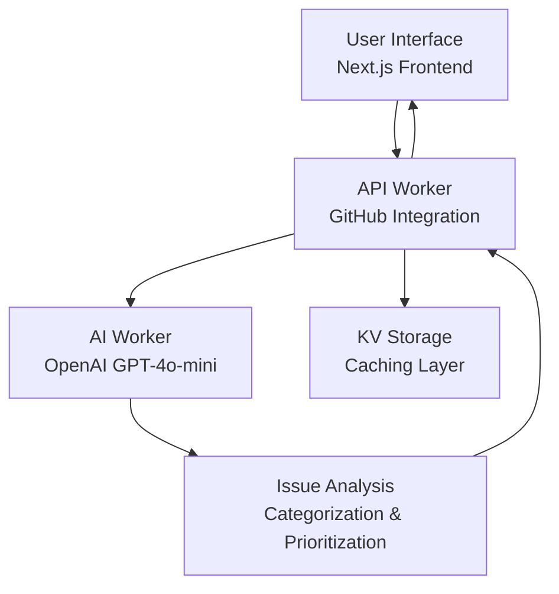

# Cloudflare AI GitHub Issue Manager

An intelligent GitHub issue management system built on Cloudflare's edge computing platform. This AI-powered application automatically analyzes GitHub repositories, categorizes issues, detects duplicates, and provides actionable insights to help development teams prioritize their work effectively.

This is my `Cloudflare Assignment` for the [Cloudflare 2026 Internship](https://www.cloudflare.com/careers/early-talent/).

## Table of Contents

- [Cloudflare AI GitHub Issue Manager](#cloudflare-ai-github-issue-manager)
  - [Table of Contents](#table-of-contents)
  - [Live Demo](#live-demo)
  - [Assignment Compliance](#assignment-compliance)
    - [Required Components](#required-components)
    - [Assignment Requirements](#assignment-requirements)
  - [Architecture Overview](#architecture-overview)
    - [Core Components](#core-components)
  - [Key Features](#key-features)
    - [Intelligent Issue Analysis](#intelligent-issue-analysis)
    - [Performance Optimizations](#performance-optimizations)
    - [Professional User Experience](#professional-user-experience)
  - [Technology Stack](#technology-stack)
    - [Frontend](#frontend)
    - [Backend](#backend)
    - [Development](#development)
  - [Quick Start](#quick-start)
    - [Prerequisites](#prerequisites)
    - [1. Clone and Install](#1-clone-and-install)
    - [2. Environment Setup](#2-environment-setup)
      - [AI Worker Configuration](#ai-worker-configuration)
      - [API Worker Configuration](#api-worker-configuration)
      - [Web Frontend Configuration](#web-frontend-configuration)
    - [3. Development](#3-development)
    - [4. Deployment](#4-deployment)
  - [Usage](#usage)
    - [Example Analysis](#example-analysis)
  - [API Endpoints](#api-endpoints)
    - [POST `/v1/analyze-repo`](#post-v1analyze-repo)
  - [Testing](#testing)
  - [Security \& Privacy](#security--privacy)
  - [License](#license)
  - [Acknowledgments](#acknowledgments)
  - [Support](#support)

## Live Demo

**Try it out:** [Deployed Application](https://your-deployed-app.com)

## Assignment Compliance

This project fulfills all requirements for the **Cloudflare AI Application Assignment**:

### Required Components

- **🤖 LLM Integration**: Uses OpenAI GPT-4o-mini for intelligent issue analysis and categorization
- **⚡ Workflow/Coordination**: Multi-worker architecture with service bindings and KV storage
- **💬 User Input Interface**: Professional Next.js web application with real-time interaction
- **🧠 Memory/State**: KV caching system with 24-hour TTL and persistent frontend state

### Assignment Requirements

- **Repository Naming**: Correctly prefixed with `cf_ai_`
- **Documentation**: Comprehensive README with setup instructions
- **Original Work**: 100% original implementation with proper attribution
- **AI Prompts**: Detailed `PROMPTS.md` with all AI-assisted development prompts

## Architecture Overview



### Core Components

1. **Web Frontend** (`/web/`)

   - Next.js 15.3.4 with App Router
   - shadcn/ui components with Tailwind CSS
   - Real-time loading states and error handling
   - Responsive design for all devices

2. **API Worker** (`/api/`)

   - Cloudflare Worker with Hono framework
   - GitHub API integration with rate limiting
   - Service binding to AI worker
   - KV storage for intelligent caching

3. **AI Worker** (`/ai/`)
   - OpenAI GPT-4o-mini integration
   - Intelligent issue categorization and prioritization
   - Duplicate detection algorithms
   - Implementation order suggestions

## Key Features

### Intelligent Issue Analysis

- **Automatic Categorization**: Bugs, Features, Enhancements, Chores, Documentation
- **Priority Assignment**: Critical, High, Medium, Low based on impact analysis
- **Duplicate Detection**: Identifies similar issues across the repository
- **Implementation Ordering**: Suggests optimal sequence for issue resolution

### Performance Optimizations

- **Smart Caching**: 24-hour KV cache to reduce API calls and costs
- **Batch Processing**: Efficient LLM calls with concurrency limits
- **Rate Limit Handling**: Graceful GitHub API rate limit management
- **Edge Computing**: Global deployment for minimal latency

### Professional User Experience

- **Modern UI**: Clean, intuitive interface with loading states
- **Real-time Feedback**: Instant analysis results with progress indicators
- **Error Handling**: Comprehensive error messages and recovery options
- **Mobile Responsive**: Optimized for all screen sizes

## Technology Stack

### Frontend

- **Framework**: Next.js 15.3.4 with App Router
- **Styling**: Tailwind CSS + Lucide React Icons + shadcn/ui components
- **HTTP Client**: Axios with TypeScript types

### Backend

- **Runtime**: Cloudflare Workers
- **Framework**: Hono for API routing
- **AI Integration**: OpenAI GPT-4o-mini
- **Storage**: Cloudflare KV for caching
- **Communication**: Service bindings between workers

### Development

- **Language**: TypeScript with strict type checking
- **Testing**: Vitest for unit testing
- **Deployment**: Wrangler CLI for Cloudflare Workers
- **Code Quality**: ESLint + Prettier

## Quick Start

### Prerequisites

- Node.js 18+ and npm
- Cloudflare account with Workers enabled
- OpenAI API key

### 1. Clone and Install

```bash
git clone https://github.com/Adedoyin-Emmanuel/cf_ai_github_issue_manager
cd cf_ai_github_issue_manager

# Install dependencies for all services
npm install
cd api && npm install
cd ../ai && npm install
cd ../web && npm install
```

### 2. Environment Setup

#### AI Worker Configuration

```bash
cd ai
wrangler secret put OPENAI_API_KEY
# Enter your OpenAI API key when prompted
```

#### API Worker Configuration

```bash
cd api
# Create KV namespace
wrangler kv:namespace create "REPO_CACHE"
wrangler kv:namespace create "REPO_CACHE" --preview

# Update wrangler.jsonc with the returned namespace IDs
```

#### Web Frontend Configuration

```bash
cd web
# Create .env.local or .env
echo "NEXT_PUBLIC_API_URL=http://localhost:8787/v1" > .env.local
```

### 3. Development

Start all services in separate terminals:

```bash
# Terminal 1 - Web Frontend
cd web && npm run dev

# Terminal 2 - API Worker
cd api && npm run dev

# Terminal 3 - AI Worker
cd ai && npm run dev
```

Visit `http://localhost:3000` to see the application.

### 4. Deployment

Deploy in order:

```bash
# 1. Deploy AI Worker
cd ai && npm run deploy

# 2. Deploy API Worker (update AI_WORKER_URL in wrangler.jsonc)
cd api && npm run deploy

# 3. Deploy Web Frontend (update NEXT_PUBLIC_API_URL)
cd web && npm run build && npm run start
```

## Usage

1. **Enter Repository URL**: Paste any public GitHub repository URL
2. **Analyze Issues**: Click "Analyze Issues" to start the AI analysis
3. **Review Results**: View categorized issues with priorities and duplicates
4. **Take Action**: Use the implementation order to prioritize your work

### Example Analysis

For a repository like `facebook/react`, the system will:

- Fetch all open issues from the GitHub API
- Categorize each issue (Bug, Feature, Enhancement, etc.)
- Assign priority levels based on impact and urgency
- Identify duplicate or similar issues
- Suggest an optimal implementation order

## API Endpoints

### POST `/v1/analyze-repo`

Analyzes a GitHub repository and returns AI-processed issue insights.

**Request:**

```json
{
  "repoUrl": "https://github.com/owner/repo"
}
```

**Response:**

```json
{
  "success": true,
  "repository": {
    "name": "repo-name",
    "owner": "owner",
    "description": "Repository description",
    "stars": 1234,
    "forks": 567,
    "openIssues": 89,
    "url": "https://github.com/owner/repo"
  },
  "issues": [
    {
      "issue_number": 123,
      "title": "Fix critical bug in authentication",
      "category": "Bug",
      "priority": "Critical",
      "duplicates": [124, 125],
      "reasoning": "Affects core functionality and has multiple reports",
      "implementationOrder": 1
    }
  ],
  "timestamp": "2025-01-27T10:30:00.000Z"
}
```

## Testing

Run the test suite:

```bash
# AI Worker tests
cd ai && npm test

# API Worker tests
cd api && npm test
```

## Security & Privacy

- **API Keys**: Securely stored as Cloudflare secrets
- **Rate Limiting**: Built-in GitHub API rate limit handling
- **CORS**: Properly configured for cross-origin requests
- **Data Privacy**: No user data stored beyond caching requirements

## License

This project is licensed under the MIT License - see the [LICENSE](LICENSE) file for details.

## Acknowledgments

- **Cloudflare Workers** for the serverless platform
- **OpenAI** for the GPT-4o-mini model
- **Next.js Team** for the excellent React framework
- **shadcn/ui** for the beautiful component library

## Support

For questions or support:

- Open an issue on GitHub
- Check the [PROMPTS.md](PROMPTS.md) for development context
- Review the [SETUP.md](SETUP.md) for detailed configuration

---

**Built with ❤️ for the Cloudflare AI Application Assignment**
